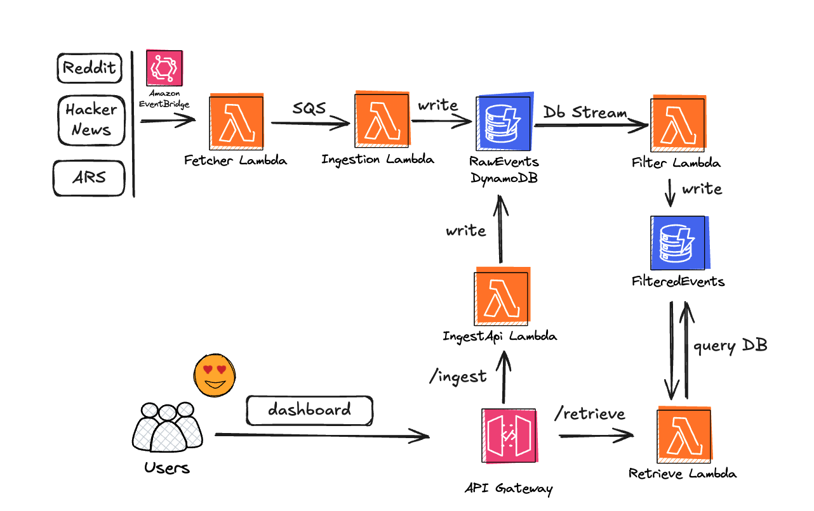

# 📰 Serverless Newsfeed Aggregator

This project implements a **serverless news aggregation pipeline** that collects events from multiple sources, filters them for relevance, and serves them through an API and dashboard.

## Table of Contents
- [Architecture Overview](#-architecture-overview)
- [Architecture Diagram](#-architecture-diagram)
- [API Usage](#-api-usage)
  - [Ingest New Event(s)](#ingest-news-events)
  - [Retrieve Filtered Events](#retrieve-filtered-events)
  - [Dashboard](#dashboard)
- [Filtering Strategy](#-filtering-strategy)
  - [Keyword-based Scoring](#keyword-based-scoring)
  - [Optional LLM-based Filtering](#optional-llm-based-filtering)
- [Testing Strategy](#-testing-strategy)
- [Assumptions](#-assumptions)
- [Improvements & Future Work](#-improvements--future-work)
- [Tech Stack](#-tech-stack)
- [Reflection](#-reflection)
  - [Why This Architecture?](#why-this-architecture)
  - [Why Keyword Filtering First?](#why-keyword-filtering-first)
  - [Why Experiment with LLMs?](#why-experiment-with-llms)
  - [What I'd Improve With More Time](#what-id-improve-with-more-time)


## 🔹 Architecture Overview



The system follows an **event-driven, serverless pipeline** on AWS:

1. **Fetcher Lambda** (triggered by EventBridge) collects data from:
   - Reddit API  
   - Ars Technica RSS  
   - Hacker News API  

2. **SQS Queue** buffers events before ingestion.

3. **Ingestion Lambda**
   - Deduplicates incoming events.  
   - Writes valid events to **RawEvents DynamoDB**.

4. **DynamoDB Stream** on RawEvents triggers the **Filtering Lambda**.

5. **Filtering Lambda**
   - Assigns relevance scores using a keyword-based strategy.  
   - Supports optional LLM-based semantic filtering.  
   - Writes results to **FilteredEvents DynamoDB**.  
   - Items expire automatically using TTL.

6. **API Gateway** exposes two endpoints:
   - **POST /ingest** → Calls *Ingest Lambda*, writes directly to RawEvents.  
   - **GET /retrieve** → Calls *Retrieve Lambda*, fetches from FilteredEvents.  
     - If `?dashboard=true`, results are optimized for the dashboard.  
     - Otherwise, returns general filtered events.


## 🔹 API Usage

### Example Payload (`payload.json`)
```json
[
  {
    "id": "abc123",
    "source": "reddit",
    "title": "Major AWS outage affecting Europe",
    "body": "AWS reports downtime in eu-west-1",
    "published_at": "2025-08-20T10:00:00Z"
  }
]
```

### Ingest News Event(s)
```bash
curl -X POST \
  https://MY-ENDPOINT.execute-api.eu-west-1.amazonaws.com/dev/ingest \
  -H "Content-Type: application/json" \
  -d @payload.json
```
### Retrieve Filtered Events

```bash
curl https://MY-ENDPOINT.execute-api.eu-west-1.amazonaws.com/dev/retrieve
```

### Dashboard 
https://newsfeed-dashboard-8xl2fzqr.s3.eu-west-1.amazonaws.com/dashboard.html

## 🔹 Filtering Strategy

### Keyword-based Scoring
- **Security** → `breach`, `ransomware`, `malware`, `phishing`  
- **Outages** → `downtime`, `outage`, `disruption`, `incident`  
- **Bugs** → `vulnerability`, `CVE`, `exploit`, `zero-day`, `patch`  

**Scoring rules:**
- Title matches are weighted more heavily than body matches.  
- Recent items get a time-based boost.  
- Final ranking = keyword score + recency score.

### Threshold Tuning & Scoring Validation:
To ensure the keyword-based filter effectively distinguishes relevant from irrelevant events, I ran precision and recall simulations on a synthetic dataset of 40 events (20 relevant, 20 irrelevant).

The script applies calculate_keyword_relevance_score(event) and evaluates precision, recall, and the number of predicted relevant events across multiple thresholds. This helps determine an optimal score threshold for filtering while balancing false positives and false negatives.

| Threshold | Precision | Recall | Predicted Relevants |
|-----------|-----------|--------|-------------------|
| 0.0       | 0.50      | 1.00   | 40                |
| 0.1       | 0.50      | 1.00   | 40                |
| 0.2       | 0.50      | 1.00   | 40                |
| 0.3       | 0.89      | 0.80   | 18                |
| 0.4       | 0.94      | 0.80   | 17                |
| 0.5       | 0.94      | 0.75   | 16                |
| 0.6       | 1.00      | 0.65   | 13                |
| 0.7       | 1.00      | 0.50   | 10                |
| 0.8       | 1.00      | 0.45   | 9                 |
| 0.9       | 1.00      | 0.35   | 7                 |
| 1.0       | 1.00      | 0.25   | 5                 |


By analyzing this table, we can select a threshold that balances precision and recall according to operational priorities—for example, favoring higher recall for critical incident detection or higher precision to reduce false positives.

This data-driven approach ensures the filter performs reliably before adding optional ML/LLM enhancements.

The final threshold selected was 0.35 - a loose but reliable filter.

### Optional LLM-based Filtering
- Uses **OpenAI API** for semantic classification.  
- Example: recognizes *“Teams service disruption”* as an outage.  
- Deterministic mode (`temperature=0`) and caching ensure stable results.  
- Disabled by default due to cost/latency and time limitations to deploy properly in AWS, but included as an **experimental enhancement**.  


## 🔹 Testing Strategy

### Unit Tests
- Validate keyword scoring and deduplication logic.  

### Integration Tests
- Mock **DynamoDB** and **SQS** with `moto`.  

### End-to-End Tests
- Run against deployed stack with sample payloads.  
- Test cleanup ensures no pollution in production tables.  

## 🔹 Assumptions
- English-language news only.  
- Keywords cover **security, outages, vulnerabilities**.  
- Small dataset (demo-scale, not production throughput).  
- LLM optional, not default.  
- Old events removed via **DynamoDB TTL**.  


## 🔹 Improvements & Future Work
- Extract **Terraform** into reusable modules.  
- **CI/CD improvements:**
  - Branch protection rules  
  - Deploy only on merge to `main`
- error handling
- Use **AWS SSM Parameter Store** for secret management.  
- Multi-region **DynamoDB replication**.  
- Host frontend with **CloudFront + Route 53**.  
- Add observability with **Datadog / X-Ray**.  
- Extend filtering with:
  - Multi-language support  
  - ML classifier (TF-IDF, BERT)  
  - Precision/recall benchmarking  


## 🔹 Tech Stack
- **AWS** → Lambda, SQS, DynamoDB, API Gateway, EventBridge, CloudWatch  
- **Terraform** → Infrastructure as Code  
- **CI/CD** → GitHub Actions  
- **Python** → Fetching, filtering, API logic  
- **Poetry** → Dependency management  
- **pytest + moto** → Testing  


## 🔹 Reflection

### Why This Architecture?
A **serverless, event-driven pipeline** reduces ops overhead while showcasing AWS event orchestration. Each stage is loosely coupled via **SQS / DynamoDB Streams**, allowing independent scaling and easy future extension.

### Why Keyword Filtering First?
Keyword scoring is **fast, deterministic, and explainable** — ideal for interviews and for incident-related domains where keywords (e.g., *“CVE”*, *“outage”*) strongly indicate relevance.

### Why Experiment with LLMs?
For an **AI Engineer role**, I prototyped an optional **LLM-based filter**. This demonstrates the ability to balance **practical MVPs** with **AI-powered enhancements**, while acknowledging trade-offs like cost and nondeterminism.

### What I'd Improve With More Time
- Hybrid **ML/LLM filtering**.  
- Further refactor
- SSM integration
- Datadog integration
- CloudFront with Route 53  
- CI/CD with **automated rollback**.  
- Richer dashboard (search, filters, relevance tuning).  
